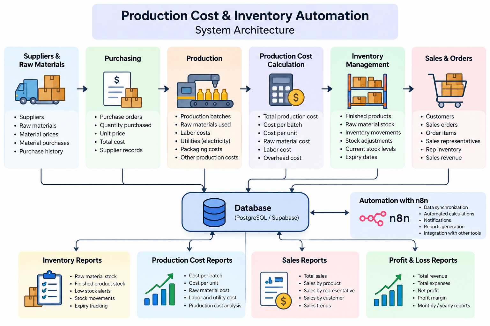

# Production Cost & Inventory Automation 🏭

A business automation system designed to manage production costs, raw materials, inventory, sales, expenses, and profitability.

## 🚀 Overview

This project demonstrates how workflow automation and database-driven systems can be used to manage the production lifecycle of a business.

The system connects raw material purchasing, production, inventory movements, sales, expenses, and financial reporting into one automated workflow.

## 🔄 Business Flow

```text
Raw Materials
      ↓
Purchasing
      ↓
Production
      ↓
Production Cost
      ↓
Inventory
      ↓
Sales
      ↓
Revenue & Expenses
      ↓
Profit & Loss
```

## ✨ Features

### 🧪 Raw Materials

* Raw material management
* Purchase records
* Purchase costs
* Shipping costs
* Available stock

### 🏭 Production

* Production batches
* Product formulas
* Required raw materials
* Production quantities
* Labor costs
* Electricity costs
* Shipping and other costs

### 📦 Inventory

* Finished product stock
* Raw material stock
* Inventory movements
* Stock withdrawals
* Production additions
* Sales deductions

### 💰 Costing

The system can calculate production and product costs based on:

* Raw materials
* Packaging
* Labor
* Electricity
* Shipping
* Other expenses

### 🛒 Sales

* Customer orders
* Order items
* Sales representatives
* Product quantities
* Revenue tracking

### 📊 Financial Reporting

* Product cost
* Sales profit
* Expenses
* Revenue
* Monthly profit and loss

## 🏗️ Architecture

```text
                    ┌─────────────────┐
                    │   Raw Materials │
                    └────────┬────────┘
                             ↓
                    ┌─────────────────┐
                    │    Purchasing   │
                    └────────┬────────┘
                             ↓
                    ┌─────────────────┐
                    │    Production   │
                    └────────┬────────┘
                             ↓
                    ┌─────────────────┐
                    │    Inventory    │
                    └────────┬────────┘
                             ↓
                    ┌─────────────────┐
                    │      Sales      │
                    └────────┬────────┘
                             ↓
                    ┌─────────────────┐
                    │ Profit & Loss   │
                    └─────────────────┘
```
## 🏗️ System Architecture


## 🛠️ Tech Stack

| Technology | Purpose                                |
| ---------- | -------------------------------------- |
| n8n        | Workflow automation                    |
| Supabase   | Database and backend                   |
| PostgreSQL | Relational data and calculations       |
| REST APIs  | System integrations                    |
| SQL        | Business logic, queries, and reporting |

## 🗄️ Main Data Areas

The system is designed around several connected business entities:

```text
Raw Materials
Purchases
Product Formulas
Production Batches
Inventory Movements
Products
Customers
Orders
Order Items
Expenses
Sales Representatives
```

## 📈 Business Intelligence

The system can provide views and calculations for:

* Current stock
* Raw material availability
* Production cost
* Product cost
* Sales profit
* Revenue
* Expenses
* Monthly profitability

## 🔐 Security

This repository is intended for portfolio demonstration.

No production credentials, passwords, API keys, or private business data should be stored in the repository.

## 🎯 Purpose

This project is part of my AI Automation portfolio and demonstrates how automation, databases, and business workflows can be combined to solve real operational problems.

---

### Built by Alia Abuzaid

AI Automation Developer | AI Agents | n8n | Business Automation
